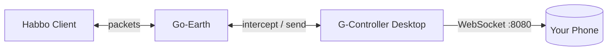

# G-Controller

Move your Habbo avatar from your phone.

## The problem

You're away from your keyboard. You still want to walk around, send chat, or look around.

## The solution

G-Controller runs on your desktop as a Go-Earth extension. It opens a web server on your home network. Your phone connects to it and becomes a controller.

No cloud. No accounts. No internet traffic between your devices.



## What you can do

**Walk around.** Drag the joystick in any direction. It snaps to 8 directions and keeps your avatar moving at ~30 FPS. Let go to stop.

**Look around.** Tap one of 8 buttons to change facing direction. Your avatar turns without walking.

**Send and read chat.** Type on your phone, messages send as normal in-game chat. Incoming messages show on every connected device.

**Install it as an app.** The mobile page works as a PWA. Add it to your home screen for a standalone experience.

## Getting started

1. Open G-Controller on your desktop
2. Flip the Mobile Controller switch
3. Scan the QR code or open the URL on your phone
4. Move, look, and chat

Your desktop and phone need the same WiFi network.

## Requirements

- Go 1.23+
- Node.js 24+
- pnpm
- Wails CLI: `go install github.com/wailsapp/wails/v2/cmd/wails@latest`
- G-Earth with extension support enabled

## Setup

```bash
git clone https://github.com/michyaraque/wired-script-engine.git
cd wired-script-engine
make install
```

## Dev

```bash
wails dev
```

## Build

```bash
wails build

# Or platform-specific
make build-mac
make build-windows
make build-linux
```

## License

GPL-3.0
